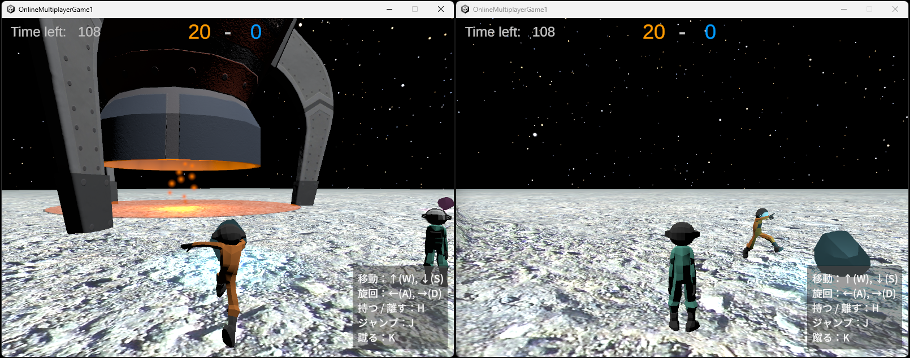
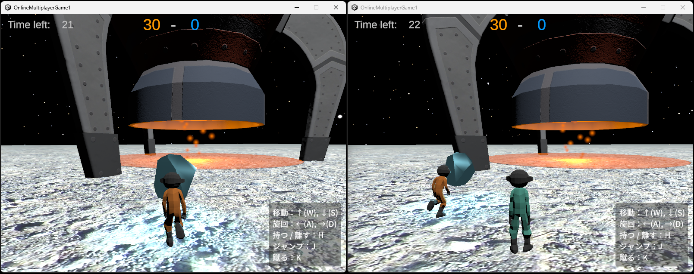
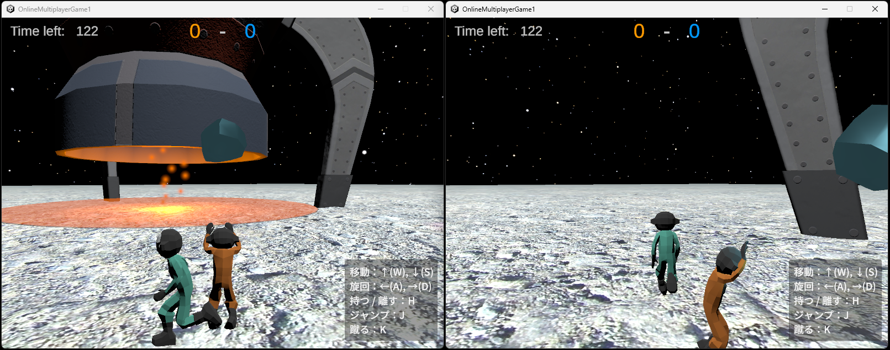

#  アストロラッシュ!!
GitHub: https://github.com/nagasawa2505/OnlineMultiplayerGame1
  
WebGL: https://xa-26483.net/astrorush/
 

宇宙での資源争奪戦！
- 2チームに分かれて遊ぶオンライン対戦ゲーム
- プレイ人数は2人、4人、6人のいずれか
- 自身のチームのロケットの下に資源を運び、高ポイントを獲得したチームが勝利

## 制作に使用したもの
- プログラミング言語
  - C#
  - Rust (Axum)
  - JavaScript (WebGL版)

- ツール
  - Unity (Ver. 2022.3.62f1)
  - Visual Studio 2022
  - さくらのクラウド (IaaS)
  - Ubuntu 24.04
  - Nginx

* Unityアセット
  - Cartoon Low-Poly Spaceship
  - LOW POLY ASTRONAULTS
  - Lunar Landscape 3D
  - Real Stars Skybox Lite

## 制作にあたって
3ヶ月間のゲーム制作訓練と、これまでのサーバーについての学習のまとめとして、3Dオンラインマルチプレイヤーゲームの制作を行いました。
- 特に注力した点
  1. WebGLとバーチャルパッドに対応しているので、スマートフォンでブラウザを起動するだけで気軽にゲームを楽しむことができます。
  2. 通信方法はWebSocket(TCP)とJSONの組み合わせですが、半精度浮動小数やビットパッキング処理によって通信量を圧縮しています。
  3. サーバーがプレイヤーに自動で参加ルームを割り当てることで、ゲームが円滑に進行するようにしています。
  4. アイテムを持つ、蹴るなど、物理的な動きを複数人で共有して楽しめるよう、どのプレイヤーがどのアイテムの情報を送信するかを、ゲーム中に細かく切り替えています。

## ゲーム説明
### 1. ルール

プレイヤーと同色のロケットの下にアイテムを運びます。 
ゲーム終了時にロケットの下にあるアイテムのポイントを計算し、合計ポイントが多いチームが勝利となります。 
相手チームのロケットの下にあるアイテムを移動させて、相手チームを減点させることもできます。

### 2. アイテムを蹴る

アイテムを蹴って移動させます。速く遠くまで運べますが、操作はちょっと難しいです。

### 3. アイテムを持ち運ぶ

アイテムをプレイヤーにくっつけて移動できますが、移動速度が落ち、ジャンプもできません。 
大きなアイテムは持ち運ぶことができません。

また、他のプレイヤーに接触すると、アイテムを放り投げてしまいます。

## 今後に実装したいこと
- より大人数での同時プレイに対応するため、通信処理や圧縮処理を改良したい
- プレイヤーの移動速度が一時的に上がる、大きなアイテムを持てるようになるなど、遊びの幅を拡げる要素を追加したい
- 宇宙に因んだ要素を追加したい
