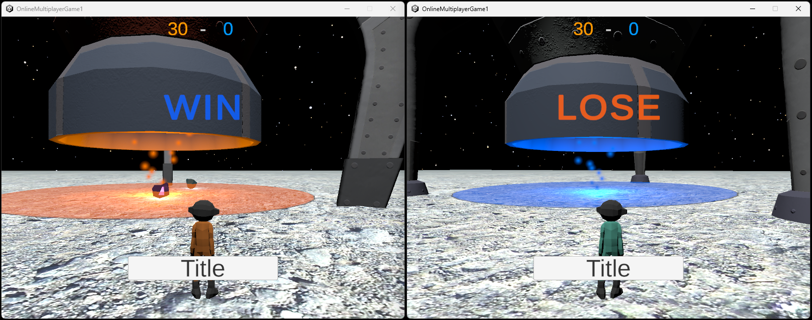

# Astro Rush!!

宇宙での資源争奪戦！

- 2チームに分かれて遊ぶオンライン対戦ゲーム
- プレイ人数は2人、または4人
- 自身のチームのロケットの下に資源を運び、高ポイントを獲得したチームが勝利

## 制作に使用したもの
- プログラミング言語
  - C#
  - Rust(Axum)

- ツール
  - Unity (Ver. 2022.3.62f1)
  - Visual Studio 2022
  - さくらのクラウド (IaaS)
  - Ubuntu 24.04
  - Nginx

* Unityアセット
  - Cartoon Low-Poly Spaceship
  - LOW POLY ASTRONAULTS
  - Lunar Landscape 3D
  - Real Stars Skybox Lite

## 制作にあたって
ゲーム制作訓練とこれまでのサーバー関連の学習のまとめとして、3Dマルチプレイヤーゲームの制作を行いました。
- 特に注力した点
  1. 通信方法をWebSocket(TCP)とJSONの組み合わせとしながらも、半精度浮動小数やビットパッキング処理を用いて通信量を圧縮しています。
  2. アイテムを持つ、蹴るなど、物理的な動きを複数人で共有して楽しめるよう、どのプレイヤーがどのアイテムの情報を送信するかを、ゲーム中に細かく切り替えています。
  3. アプリケーションサーバーをストレージの読み書きを行わないシンプルな実装にすることで、サーバー処理による遅延を抑制しています。

## ゲーム説明
### 1. ルール

プレイヤーと同色のロケットの下にアイテムを運びます。 
ゲーム終了時にロケットの下にあるアイテムのポイントを計算し、合計ポイントが多いチームが勝利となります。 
相手チームのロケットの下にあるアイテムを移動させて、相手チームを減点させることもできます。

### 2. アイテムを蹴る

アイテムを蹴って移動させます。速く遠くへ運べますが、操作はちょっと難しいです。

### 3. アイテムを持ち運ぶ

アイテムをプレイヤーにくっつけて移動できますが、移動速度が落ちます。 
大きなアイテムは持ち運ぶことができません。

また、他のプレイヤーに接触すると、アイテムを放り投げてしまいます。

## 今後に実装したいこと
- ステージを増やしたい
- 通信部分の実装やサーバーの構成を改良して、プレイ人数を増やしたい
- 一時的に移動速度が上がる、大きなアイテムを持てるようになる等、遊びの幅を拡げる要素を追加したい
