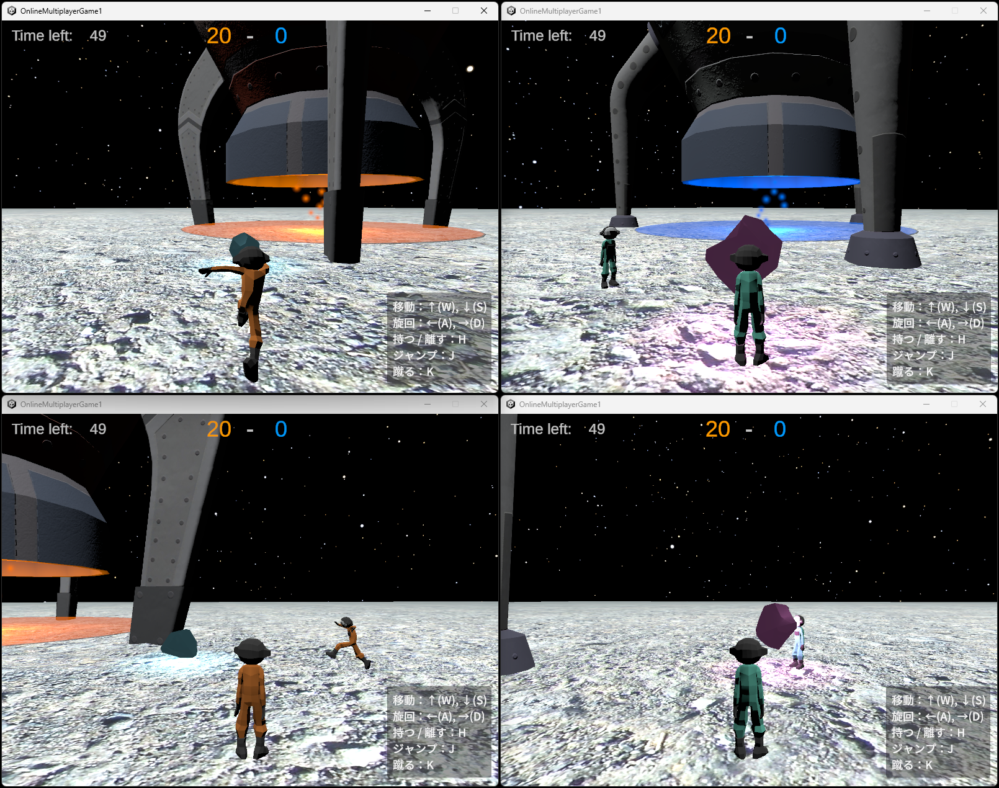

# Astro Rush!!

宇宙での資源争奪戦！

- 2チームに分かれて遊ぶオンライン対戦ゲーム
- ゲーム終了時により多くの資源を自陣に残したチームが勝利
- プレイ人数は2人、または4人

## 制作に使用したもの
- プログラミング言語
  - C#
  - Rust(Axum)

- ツール
  - Unity (Ver. 2022.3.62f1)
  - Visual Studio 2022
  - さくらのクラウド (IaaS)
  - Ubuntu 24.04
  - Nginx

* Unityアセット
  - Cartoon Low-Poly Spaceship
  - LOW POLY ASTRONAULTS
  - Lunar Landscape 3D
  - Real Stars Skybox Lite

## 制作にあたって
ゲーム制作訓練の受講と、これまでのサーバー関連の学習のまとめとして、3Dマルチプレイヤーゲームの制作を行いました。
- 特に注力した点
  1. 通信方法をWebsocket(TCP)とJSONの組み合わせとしながらも、半精度浮動小数やビットパッキング処理を用いて通信量を圧縮しています。
  2. アイテムを持つ、蹴るなど、物理的な動きを複数人で共有して楽しめるよう、どのプレイヤーがどのアイテムの情報を送信するかを、ゲーム中に細かく切り替えています。
  3. アプリケーションサーバーをストレージへの読み書きを行わないシンプルな実装にすることで、サーバー処理による遅延を抑制しています。

## ゲーム説明
### 1. アイテムを蹴る

アイテムを蹴って移動させます。速く遠くへ運べますが、操作はちょっと難しいです。

### 2. アイテムを持ち運ぶ

アイテムをプレイヤーにくっつけて移動できますが、移動速度が落ちます。 
大きなアイテムは持ち運ぶことができません。

また、他のプレイヤーに接触すると、アイテムを放り投げてしまいます。

### 3. 勝敗

プレイヤーと同色のロケット下にアイテムを運びます。 
ゲーム終了時に、そこに置かれたアイテムのポイントを合計して勝敗が決まります。 
相手が置いたアイテムをロケット下から移動させて減点させることもできます。
